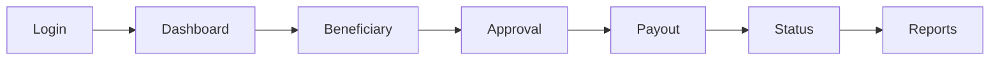
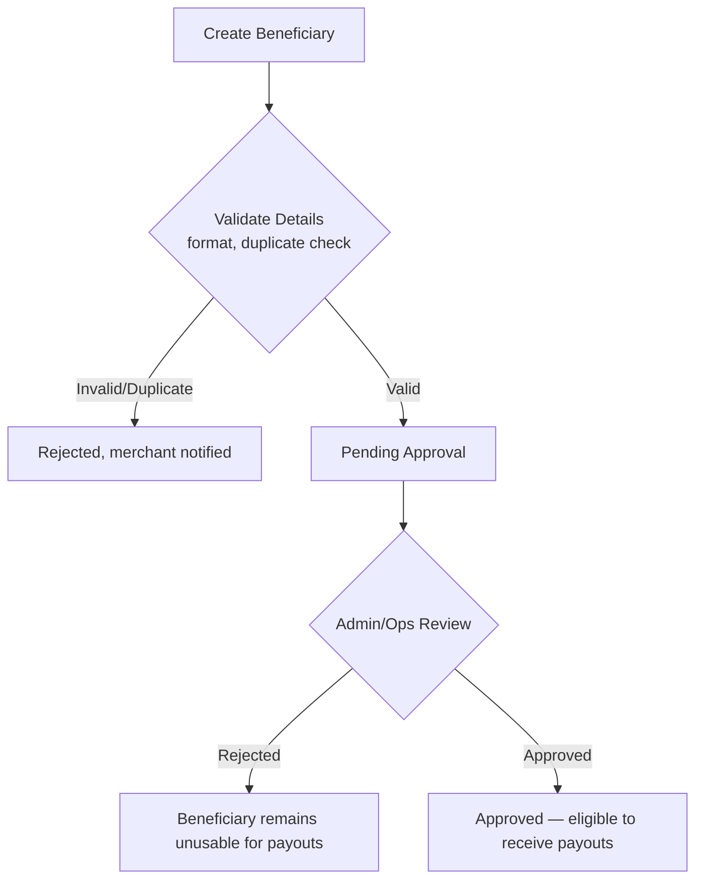
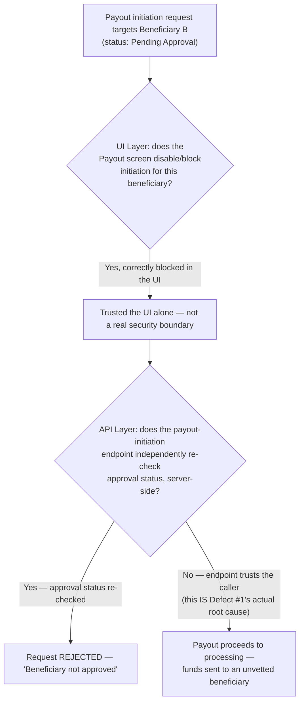
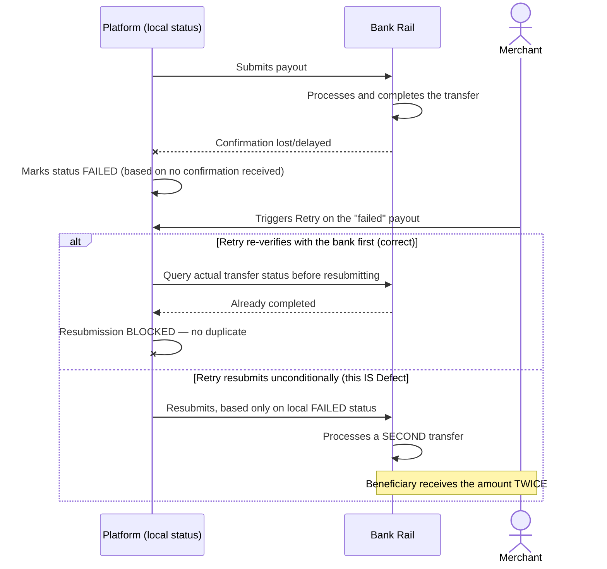
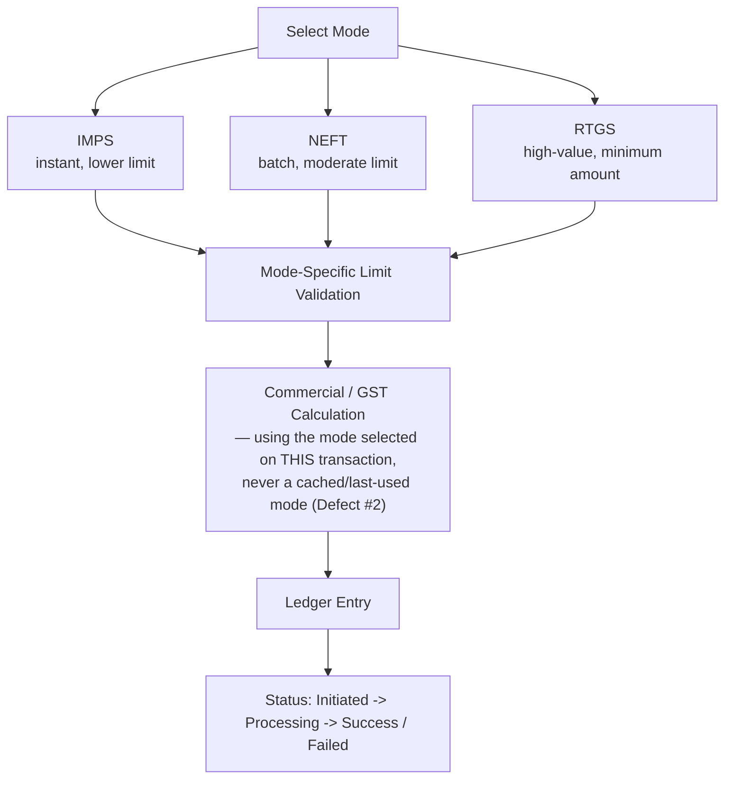
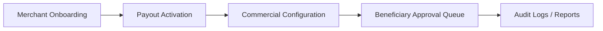
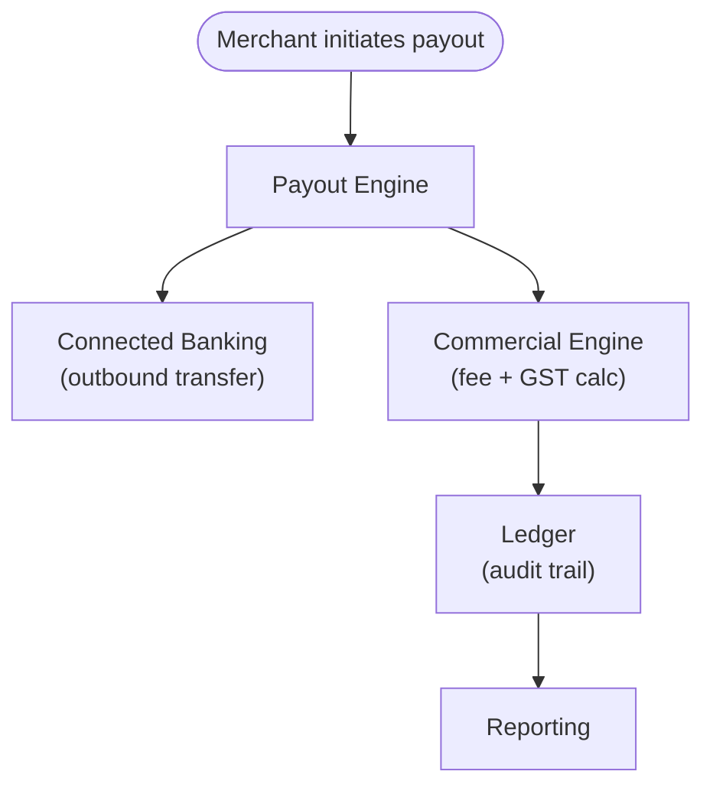

# Payout Engine — Architecture & Flow

> This is the internal, system-level "Tech Flow" view. For the merchant/beneficiary-facing
> journey, see [`business-flow.md`](./business-flow.md). For the service-level (microservice)
> view behind these diagrams, see [`service-architecture.md`](./service-architecture.md). See
> [`README.md`](./README.md) for the full documentation map.
>
> Every diagram below is drawn in [Mermaid](https://mermaid.js.org/), which GitHub renders
> natively in-page — nothing here requires opening another site or tool to read it.

## Merchant Regression Flow (Primary End-to-End Scenario)

## Beneficiary Approval Flow (Highest-Risk Path)

**Testing implication:** a payout attempted against a beneficiary that is `Pending Approval` or
`Rejected` must always be blocked — this boundary is tested as rigorously as the payout itself.
Section below shows exactly what happens when that boundary is only enforced in one place.

## The Real Mechanism Behind Defect #1 — Approval as Defense in Depth

[`sample-defect-report.md`](../sample-defect-report.md) Defect #1 (a payout succeeding via API
against an unapproved beneficiary) is the same structural defect class this portfolio's HRMS and
Reseller repos each hit in their own domains — a check enforced in exactly one layer, with
nothing underneath it:

**Why "the UI already blocks this" was never going to be sufficient:** a UI-level block only
stops a browser session that renders that screen from *offering* the action — it does nothing
against a direct call to the payout-initiation endpoint, whether from a script, a replay, or
simply a second client that never implemented the same check. The fix
[`sample-defect-report.md`](../sample-defect-report.md) prescribes — enforce the approval check
at the service/API layer, not only in the UI — is the right one specifically because every entry
point into the system has to independently agree on the same rule, not inherit it from whichever
layer happened to implement it first.

## The Real Mechanism Behind Defect #3 — Retry Without Verifying Ground Truth First

**Why this is the single highest-severity defect class in the module, and why the fix isn't
"retry faster" or "retry less":** the local `FAILED` status was never actually confirmed by the
bank — it's an absence of confirmation, which (per this guide's own distinction elsewhere in this
portfolio) is "unknown," not "no." Retrying based on an *unconfirmed* failure is only safe if the
retry itself first asks the one party that actually knows the ground truth — the bank — before
resubmitting. [`sample-defect-report.md`](../sample-defect-report.md)'s suggested fix (query the
bank rail or an authoritative reconciliation source before any retry) is the only version of this
that can't produce a duplicate transfer, because it removes the platform's own unconfirmed local
status as the thing retry logic trusts.

## Payout Transfer Flow by Mode

**The Defect #2 callout inside this diagram, briefly:** `BUG-PAY-3042` happened because the
commercial calculation step read the merchant's *most recently used* mode instead of the mode
explicitly selected on *this* transaction — a caching/state bug with the same shape as Defect #1
and #3 above: trusting an ambient, possibly-stale value instead of an explicit, per-request fact.

## Admin Flow

## System Interaction Map

## Why the Flow Order Matters for Testing

Every step depends on state built by the previous one:

1. **Beneficiary** must exist and pass validation before it can enter approval
2. **Approval** must succeed before a payout can target that beneficiary — and that check must
   hold at every entry point, per Defect #1 above
3. **Payout** must respect the selected mode's limits and commercial rules, read explicitly per
   transaction, per Defect #2 above
4. **Status** must accurately reflect the true state of the transfer at every poll — and Retry
   must verify ground truth before ever resubmitting, per Defect #3 above
5. **Reports** must match ledger and status data exactly — no drift on export

This is why the Payout regression suite (manual and automated) walks the full path in order,
with particular emphasis on the beneficiary → approval boundary and Retry idempotency, since
both are where the least room for error exists.

**See also:** [`ui-consistency.md`](./ui-consistency.md) for how these same steps must render
consistently across screens; the concrete test cases derived from this flow live in
[`../regression-checklist.md`](../regression-checklist.md).
