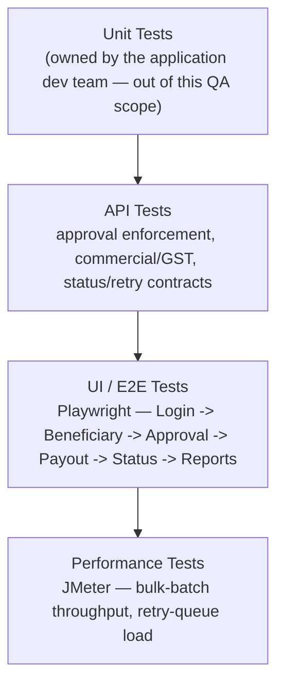
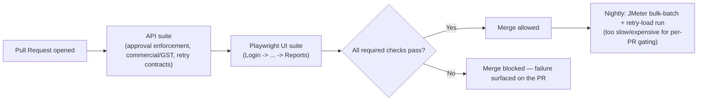

# Payout Engine — Tech Stack & Skills Demonstrated

> Everything in this doc is answerable by reading this repo alone — no need to visit an external
> site to understand what was used or why. This doc is a **skill-oriented index** into content
> that's already documented elsewhere in this repo (business-overview, business-flow,
> feature-modules, service-architecture) — it doesn't duplicate that content, it cross-references
> it by *skill* rather than by *product flow*, which none of those other docs do. Section 5 below
> also gives the performance-testing approach the depth the tech stack table claims (JMeter) but
> no dedicated report yet demonstrates — unlike this portfolio's Collection Engine repo, which has
> a real executed load test.

## 1. Full Tech Stack, and Why Each Tool

| Category | Tool | Why This Tool Specifically |
|---|---|---|
| **UI Automation** | Playwright, TypeScript, Page Object Model | See [`../automation/README.md`](../automation/README.md) for the framework rationale |
| **API Testing & Automation** | Playwright API requests, Postman | Validates payout payloads and — critically — approval-status enforcement directly at the API layer, independent of what the UI shows (see [`architecture-and-flow.md`](./architecture-and-flow.md)'s Defect #1 mechanism) |
| **Performance Testing** | JMeter | Bulk-batch throughput and retry-queue load testing (section 5 below) |
| **CI/CD** | Jenkins / GitHub Actions | Automates the regression suite on a schedule/trigger |
| **Bug Tracking & Traceability** | JIRA, RTM | Full defect lifecycle tracking plus requirement-to-test-coverage traceability — see [`../sample-rtm.md`](../sample-rtm.md) |
| **Version Control** | Git, GitHub | This repo itself; diagrams throughout `architecture-and-flow.md` are Mermaid, which GitHub renders natively with zero extra tooling |

## 2. Skills Demonstrated — Skill → Where to See It

| Skill | Demonstrated By | Where to Look |
|---|---|---|
| **Manual / Functional Testing** | Full Login-to-Reports regression suite (67 cases) | [`../regression-checklist.md`](../regression-checklist.md) |
| **API Testing** | Payout payloads, approval-status enforcement, commercial/GST calculation | [`../regression-checklist.md`](../regression-checklist.md) |
| **UI Automation** | Playwright + POM spec covering the highest-priority merchant journey | [`../automation/sample-payout.spec.ts`](../automation/sample-payout.spec.ts) |
| **Security-Adjacent Defense-in-Depth Testing** | A dedicated test category confirming the approval check holds at the API layer independently of the UI | [`../sample-defect-report.md`](../sample-defect-report.md) Defect #1; [`architecture-and-flow.md`](./architecture-and-flow.md) |
| **Idempotency / Retry-Safety Testing** | Confirming Retry verifies ground truth with the bank before resubmitting — this module's single highest-severity test category | [`../sample-defect-report.md`](../sample-defect-report.md) Defect #3 |
| **Performance Testing** | JMeter-based bulk-batch and retry-queue load testing | Section 5 below |
| **Service-Boundary / Integration Testing** | Identifying which of ~38 services sit on which integration boundary | [`service-architecture.md`](./service-architecture.md) |
| **Requirement Traceability (RTM)** | A worked requirement → test case → status mapping | [`../sample-rtm.md`](../sample-rtm.md) |
| **Defect Management & Root-Cause Analysis** | Worked defects identifying the actual mechanism (a check enforced in one layer only; a stale cached mode value; an unconfirmed-status retry) rather than just the symptom | [`../sample-defect-report.md`](../sample-defect-report.md) |
| **Test Reporting & Metrics** | A structured execution summary | [`../regression-execution-summary.md`](../regression-execution-summary.md) |
| **Technical Documentation & Communication** | The full seven-document `docs/` set | [`README.md`](./README.md) |

## 3. The Testing Pyramid Applied to This Project

## 4. CI/CD — Suggested Pipeline Shape

> **Note on scope, matching this repo's existing honesty convention** (see
> [`../automation/README.md`](../automation/README.md)): this repo includes one representative
> Playwright spec rather than the full framework, to stay focused as a portfolio piece.

## 5. Performance Testing, In Depth

This module's performance risk is concentrated in two specific paths, not generic throughput:

| Test Type | What It Targets | Why It Matters Here Specifically |
|---|---|---|
| **Bulk-batch throughput test** | A single bulk payout batch containing hundreds/thousands of beneficiaries, processed concurrently | Per-item status accuracy (`BUG-PAY-3096`) is a correctness property that has to hold *at scale*, not just for a 10-item test batch — a batch-summary aggregation bug is more likely to surface, not less, as item count grows |
| **Retry-queue load test** | Many retries (across different merchants/payouts) being processed concurrently, each required to verify ground truth with the bank before resubmitting | This is the performance equivalent of [`architecture-and-flow.md`](./architecture-and-flow.md)'s Defect #3 diagram — a ground-truth check that's correct for one retry tested in isolation needs to stay correct when many retries are competing for the same bank-rail query capacity at once, not silently fall back to "resubmit anyway" under load pressure |
| **Mode-specific limit validation under load** | Concurrent payouts across all three modes (IMPS/NEFT/RTGS) simultaneously approaching their respective limits | Confirms limit enforcement and commercial calculation (Defect #2's territory) stay correctly scoped per-request even when many requests for different modes are in flight at once |

**What this is deliberately not:** a claim that this module needs payment-gateway-style sustained
transaction throughput. The realistic risk is specifically whether *correctness-critical checks*
(approval enforcement, retry ground-truth verification, per-item batch accuracy) continue to hold
under the concurrent load those checks were never tested against in isolation.

## 6. Why This Doc Exists Separately From the Other Docs

[`business-overview.md`](./business-overview.md), [`business-flow.md`](./business-flow.md),
[`feature-modules.md`](./feature-modules.md), and [`service-architecture.md`](./service-architecture.md)
are all organized around the *product*. This doc is organized around *skills*, so a reader
looking for "where's the performance testing evidence" or "where's the retry-safety proof"
doesn't have to reconstruct that index themselves from four product-oriented documents.
